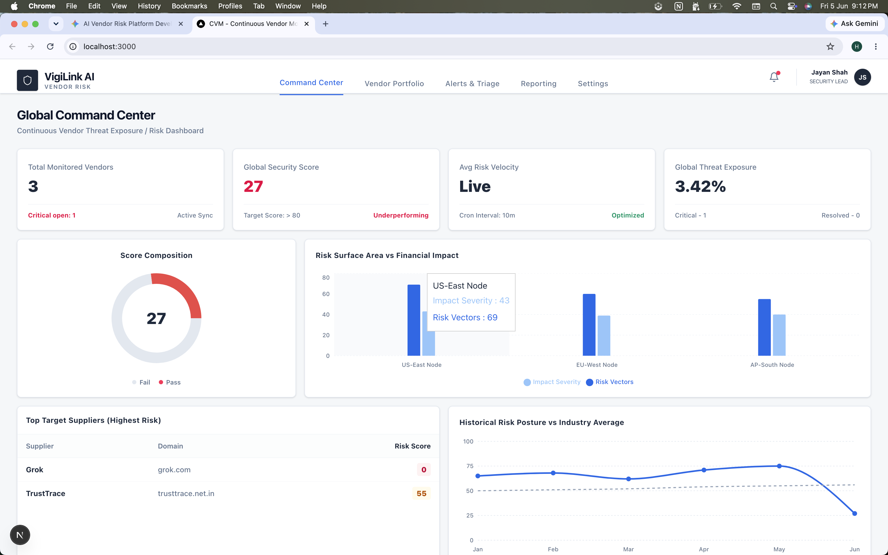
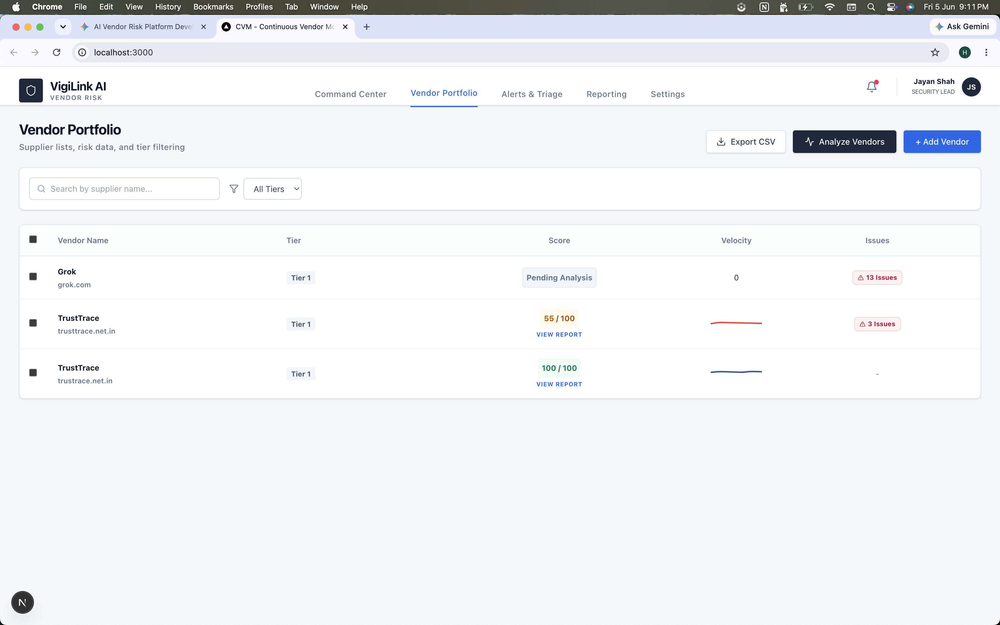
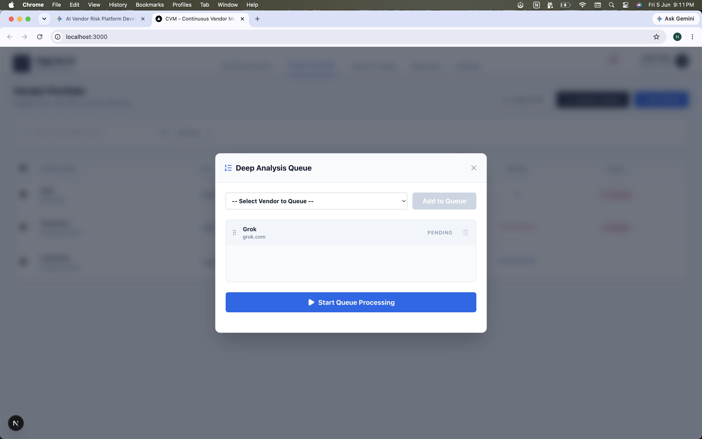
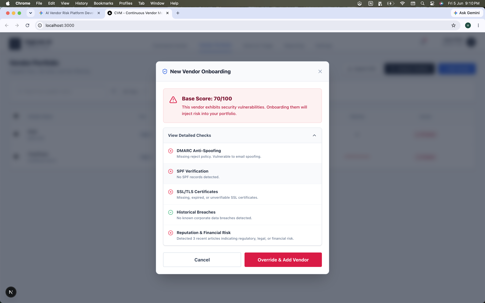
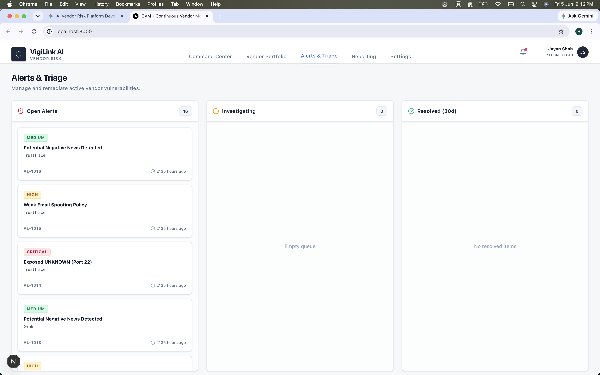
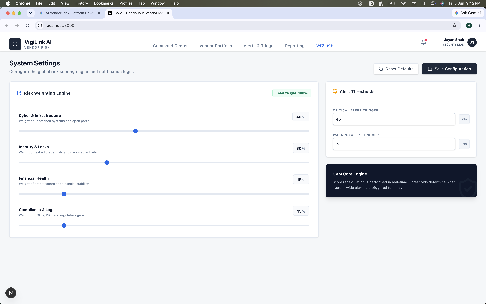
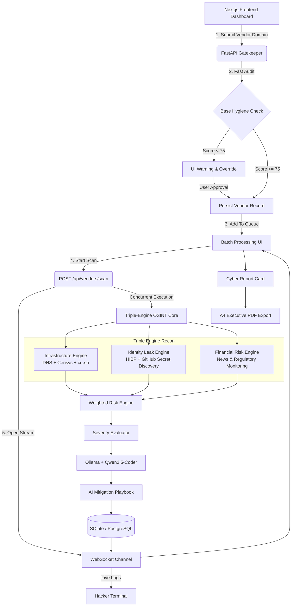

# 🛡️ VigiLink AI Recon Engine

### Continuous Vendor Monitoring (CVM) & Automated Third-Party Risk Management

<p align="center">


</p>

<p align="center">
  
</p>

<p align="center">
  <b>Production-Grade Third-Party Risk Management Platform Powered by OSINT Intelligence and Air-Gapped AI</b>
</p>

---


## 📖 Overview

**VigiLink AI** is a production-grade **Continuous Vendor Monitoring (CVM)** platform built to modernize **Third-Party Risk Management (TPRM)**.

Traditional vendor assessments rely on annual questionnaires that quickly become outdated. VigiLink replaces that approach with:

* 🔍 Real-time OSINT reconnaissance
* 🌐 Infrastructure exposure analysis
* 🔑 Identity & credential leak monitoring
* 📰 Regulatory and financial risk tracking
* 🧠 Air-gapped AI risk interpretation
* 📄 Executive-ready remediation playbooks

The platform continuously evaluates vendor security posture and transforms raw technical findings into actionable business intelligence.

---


# 🎯 Product Walkthrough

Explore the major workflows and intelligence capabilities available within VigiLink AI.

---

## 🌍 Global Command Center

Real-time visibility into vendor exposure, risk velocity, security posture, and operational threat intelligence.

<p align="center">
  
</p>

---

## 📋 Vendor Portfolio Management

Track, categorize, and continuously monitor suppliers through a centralized portfolio dashboard.

<p align="center">
  
</p>

### Key Features

- Tier-based vendor classification
- Continuous monitoring status
- Risk score tracking
- Issue visibility
- CSV exports
- Boardroom reporting

---

## 🔀 Deep Analysis Queue

Batch multiple vendors and execute large-scale asynchronous assessments.

<p align="center">
  
</p>

### Capabilities

- Queue orchestration
- Vendor prioritization
- Batch execution
- Drag-and-drop workflows

---

## 📡 Live OSINT Recon Telemetry

Watch reconnaissance engines execute in real time through the integrated Hacker Terminal.

<p align="center">
  
</p>

Live intelligence includes:

- DNS reconnaissance
- Subdomain discovery
- Open port detection
- HIBP breach intelligence
- Financial risk monitoring
- AI processing telemetry

---

## 🚨 Alerts & Triage Center

Security findings automatically generate actionable analyst alerts.

<p align="center">
  
</p>

### Alert Classification

| Severity | Response |
|-----------|-----------|
| Critical | Immediate Action |
| High | Escalation |
| Medium | Investigation |
| Low | Monitoring |

---

## ⚙️ Risk Weighting Engine

Customize how vendor risk scores are calculated across multiple intelligence domains.

<p align="center">
  
</p>

### Adjustable Risk Categories

- Cyber Infrastructure
- Identity & Data Leaks
- Financial Health
- Compliance & Legal

### Dynamic Threshold Controls

- Critical Alert Trigger
- Warning Alert Trigger
- Global Risk Scoring Logic

---


# 🏗️ System Architecture

The platform combines a reactive Next.js frontend, asynchronous FastAPI backend, and a multi-engine OSINT intelligence layer.



---

# ⚡ Core Architectural Features

---

## 🛡️ 1. Dual-Phase Vendor Triage (Gatekeeper)

### Objective

Prevent database bloat and preserve OSINT API quotas before initiating expensive infrastructure scans.

### What It Checks

#### 📧 Email Security Hygiene

* SPF validation
* DMARC enforcement verification
* Phishing resistance assessment

#### 🔒 Certificate Health

* SSL/TLS inspection via `crt.sh`
* Certificate validity checks
* Encryption posture verification

### Outcome

| Result     | Action                   |
| ---------- | ------------------------ |
| Score ≥ 75 | Automatically Approved   |
| Score < 75 | Requires Manual Override |

---

## 🔀 2. Async Multi-Engine Recon Pipeline

### Objective

Perform large-scale OSINT collection without blocking users or backend resources.

Powered by:

```python
asyncio.gather(...)
```

All intelligence engines execute simultaneously.

### ☁️ Infrastructure Intelligence

Sources:

* Censys V3
* Google DNS
* crt.sh

Capabilities:

* IPv4 resolution enforcement
* Subdomain enumeration
* Open port discovery
* Service fingerprinting

Monitored Ports:

```text
22    SSH
3389  RDP
8080  HTTP Alternate
```

---

### 🔑 Identity Leak Intelligence

Sources:

* HaveIBeenPwned (HIBP)
* Public GitHub repositories

Capabilities:

* Credential exposure discovery
* .env leakage detection
* API key exposure
* Secret token harvesting

---

### 📰 Contextual Risk Intelligence

Monitors:

* Regulatory actions
* Financial instability
* Public breach disclosures
* Mass layoffs
* Compliance violations

This enables risk assessment beyond pure technical vulnerabilities.

---

## 📡 3. Real-Time Streaming Telemetry

### Objective

Provide continuous visibility into long-running scans.

Instead of traditional polling:

```http
GET /status
GET /status
GET /status
```

VigiLink streams updates through:

```text
ws://localhost:8000/ws
```

### Benefits

* Instant scan progress
* Lower server overhead
* Reduced latency
* Better user experience

### UI Component

```text
Hacker Terminal
```

Live OSINT events are pushed directly into the React frontend through a dedicated WebSocket hook.

---

## 🧠 4. Air-Gapped AI Risk Analysis

### Objective

Convert raw findings into boardroom-ready intelligence without exposing sensitive data externally.

---

### Risk Scoring Engine

Deterministic severity calculations:

| Severity | Score Impact |
| -------- | ------------ |
| Critical | -20          |
| High     | -10          |
| Medium   | -5           |
| Low      | -2           |

This ensures transparent and explainable scoring.

---

### Local AI Processing

Model:

```text
Qwen2.5-Coder 7B
```

Runtime:

```text
Ollama
```

Processing Flow:

```text
OSINT Findings
      ↓
Structured JSON
      ↓
Local LLM
      ↓
Mitigation Playbook
```

### Security Advantage

✅ No external AI APIs

✅ No vendor data leaves the network

✅ Fully air-gapped analysis

---

# 🛠️ Technology Stack

| Layer          | Technology                         | Responsibility                |
| -------------- | ---------------------------------- | ----------------------------- |
| Frontend       | React 19 + Next.js 15 + TypeScript | Dashboard & State Management  |
| Styling        | Tailwind CSS                       | Responsive UI & Theming       |
| Visualization  | Recharts                           | Risk Analytics & Trend Charts |
| Backend        | FastAPI                            | API Orchestration             |
| Async Runtime  | asyncio + aiohttp                  | Concurrent OSINT Collection   |
| Realtime Layer | WebSockets                         | Live Telemetry Streaming      |
| AI Engine      | Ollama + Qwen2.5-Coder             | Local Risk Interpretation     |
| ORM            | SQLAlchemy                         | Database Mapping              |
| Database       | SQLite / PostgreSQL                | Persistence Layer             |

---

# 🚀 Getting Started

## Prerequisites

Install:

* Node.js 18+
* Python 3.11+
* Ollama

---

# 1️⃣ Start Local AI Engine

Pull and launch the model:

```bash
ollama run qwen2.5-coder:7b
```

This enables fully local AI-generated remediation guidance.

---

# 2️⃣ Backend Setup (FastAPI)

Navigate to the backend directory:

```bash
cd backend
```

Create a virtual environment:

```bash
python3 -m venv venv
```

Activate it:

### macOS / Linux

```bash
source venv/bin/activate
```

### Windows

```powershell
venv\Scripts\activate
```

Install dependencies:

```bash
pip install -r requirements.txt
```

Launch FastAPI:

```bash
python -m uvicorn app.main:app --reload --port 8000
```

Backend available at:

```text
http://localhost:8000
```

---

# 3️⃣ Frontend Setup (Next.js)

Navigate to frontend:

```bash
cd frontend/vendor-risk-ops
```

Install dependencies:

```bash
npm install
```

Start development server:

```bash
npm run dev
```

Frontend available at:

```text
http://localhost:3000
```

---

# 🎯 Usage Workflow

---

## Step 1 — Gatekeeper Validation

Enter a vendor domain:

```text
badssl.com
scanme.nmap.org
miro.com
```

VigiLink performs:

* SPF validation
* DMARC verification
* SSL inspection

Execution time:

```text
~2 Seconds
```

---

## Step 2 — Queue Management

Approved vendors enter the monitoring queue.

Features:

* Drag-and-drop prioritization
* Batch scheduling
* Risk pipeline management

---

## Step 3 — Deep Recon Scan

Click:

```text
Start Queue Processing
```

The platform launches:

* Censys
* crt.sh
* HIBP
* GitHub Intelligence
* Financial Risk Monitoring

All engines execute concurrently.

---

## Step 4 — Boardroom Report Generation

Open:

```text
View Report
```

Generated insights include:

* Exposed services
* Open ports
* Hosting providers
* Geographic exposure
* Credential leaks
* Regulatory concerns
* AI-generated remediation guidance

---

## Step 5 — Executive PDF Export

Click:

```text
Export as PDF
```

The dashboard automatically switches into a print-optimized A4 report layout.

---

# 📂 Project Structure

```bash
VigiLink-AI/
│
├── backend/
│   ├── app/
│   ├── services/
│   ├── scanners/
│   ├── websocket/
│   └── database/
│
├── frontend/
│   └── vendor-risk-ops/
│       ├── app/
│       ├── components/
│       ├── hooks/
│       └── lib/
│
├── docs/
├── screenshots/
└── README.md
```

---

# 🤝 Contributing

Contributions are welcome.

Because the architecture is fully decoupled, new OSINT engines can be added independently without impacting frontend workflows.

Typical contribution areas:

* Additional OSINT providers
* Threat intelligence feeds
* Scoring enhancements
* UI improvements
* AI playbook optimization

---

# 📜 License

Licensed under the **MIT License**.

Feel free to use, modify, and distribute under the terms of the license.

---

<p align="center">

**Built for Modern Third-Party Risk Operations**

🛡️ Continuous Monitoring • 🔍 OSINT Intelligence • 🧠 Local AI Analysis

</p>
