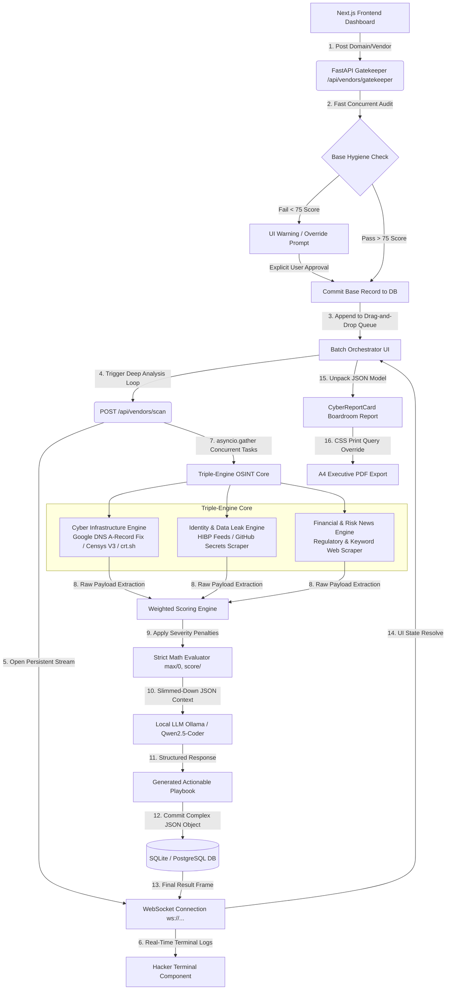

# VigiLink AI Recon Engine 🛡️🤖
**Continuous Vendor Monitoring (CVM) & Automated Third-Party Risk Management**

[](https://nextjs.org/)
[](https://fastapi.tiangolo.com/)
[](https://www.python.org/)
[](https://ollama.com/)

VigiLink AI is a production-ready, full-stack Continuous Vendor Monitoring (CVM) platform designed to automate third-party risk management (TPRM). Instead of relying on static annual security questionnaires, VigiLink conducts real-time, multi-engine OSINT sweeps, assesses data leak exposure, evaluates regulatory news, and utilizes an air-gapped local AI engine to generate contextual, boardroom-ready mitigation playbooks.

---

## 🏗️ Core System Architecture & Data Flow

Below is the complete end-to-end architecture mapping out the reactive frontend state, the asynchronous Python backend, and the decoupled external OSINT layers.



---

## ⚡ Key Architectural Features

## ⚡ Key Architectural Features

### 🛡️ 1. Dual-Phase Triage (The Gatekeeper)
> **Objective:** Prevent database bloat and optimize API quotas before authorizing heavy infrastructure sweeps.

The platform implements a synchronous, pre-screening triage endpoint (`/api/vendors/gatekeeper`). It rapidly evaluates fundamental security postures:
* **Email Hygiene:** Queries Google DNS for active **SPF** and **DMARC** enforcement policies to detect phishing vulnerabilities.
* **Encryption Standards:** Checks `crt.sh` logs for valid, up-to-date SSL/TLS certificate configurations.

### 🔀 2. Async Non-Blocking Multi-Engine Aggregation
> **Objective:** Execute massive, IO-bound recon tasks concurrently without freezing the user interface.

Using Python’s `asyncio.gather`, the backend decouples target workflows into isolated, simultaneous runtime layers:
* **☁️ Infrastructure (Censys V3 & DNS):** Explicitly forces IPv4 resolutions to bypass modern IPv6 enterprise load-balancer blindspots. It maps active subdomains and profiles networks for dangerous open endpoints (e.g., Ports `22`, `3389`, `8080`).
* **🔑 Identity Leak Profiler:** Inspects dark web feeds (HIBP) and scrapes public GitHub repositories for exposed `.env` files, config parameters, and hardcoded cryptography tokens.
* **📰 Contextual Risk Scraper:** Monitors global news pipelines for keywords correlating to financial distress, mass layoffs, or regulatory breaches.

### 📡 3. Real-Time Streaming Telemetry (WebSockets)
> **Objective:** Provide instant, frictionless feedback to the end-user during long-running tasks.

Background tasks pipeline their progress straight to the client-side UI via standard WebSockets (`ws://...`). A dedicated React custom hook parses these real-time chunks, piping a live "Hacker Terminal" feedback stream directly into an execution viewport—completely eliminating the need for legacy, resource-heavy HTTP polling.

### 🧠 4. Severity-Based Weights & Air-Gapped AI Playbooks
> **Objective:** Translate raw JSON vulnerabilities into actionable boardroom intelligence without leaking data.

* **Strict Math Engine:** Scores are evaluated using a deterministic risk-matrix algorithm rather than flat deductions (e.g., Critical Finding = `-20 pts`, Medium Finding = `-5 pts`).
* **Local LLM Integration:** The resultant vulnerability data frame is serialized into a clean prompt matrix and processed by an isolated, local **Qwen2.5-Coder (7B)** model via Ollama. Because the AI runs entirely on localhost, zero proprietary data leaves the network while it acts as a defensive engineer generating a target-specific mitigation playbook.


---

## 🛠️ Tech Stack & Engineering Boundaries

| Layer | Technology | Primary Mandate |
| :--- | :--- | :--- |
| **Frontend UI** | React 19 / Next.js / TypeScript | Reactive state management, HTML5 Drag-and-Drop batching, Tailwind dynamic themes |
| **Data Viz** | Recharts | Computes vendor risk velocities using non-blocking vector sparklines |
| **Backend Core** | FastAPI (Python 3.11+) | Asynchronous orchestration, WebSocket endpoints, structured JSON routers |
| **Async Client** | `aiohttp` | Non-blocking concurrent HTTP requests to external OSINT providers |
| **Local AI Layer** | Ollama / Qwen2.5-Coder | Local, zero-data-leak contextual analysis and defensive remediation mapping |
| **Database** | SQLAlchemy ORM / SQLite | Complex relational mapping of unstructured target JSON payloads |

---

## 🚀 Getting Started

### Prerequisites
* **Node.js** (v18+)
* **Python** (v3.11+)
* **Ollama Client** (For the Air-gapped LLM runner)

### 1. Start the Local AI Engine
VigiLink AI ensures zero data leakage by analyzing vulnerabilities locally. Open a terminal and run:
```bash
ollama run qwen2.5-coder:7b


⚙️ 2. Backend Installation (FastAPI)
The backend utilizes asynchronous Python to orchestrate the OSINT gatherers and calculate the weighted risk matrices.

Open a new terminal and navigate to the backend directory:
cd backend

# Create and activate a pristine virtual environment
python3 -m venv venv
source venv/bin/activate  # Windows users: venv\Scripts\activate

# Install the required Python dependencies
pip install -r requirements.txt

# Boot the Uvicorn ASGI server
python -m uvicorn app.main:app --reload --port 8000


(The backend is now actively listening for WebSocket connections and REST API calls on Port 8000).

🖥️ 3. Frontend Installation (Next.js)
The frontend is a highly reactive Next.js application utilizing Tailwind CSS for custom styling and Recharts for dynamic data visualization.

Open a final, separate terminal and navigate to the frontend directory:
cd frontend/vendor-risk-ops

# Clean install all Node dependencies
npm install

# Start the Next.js development server
npm run dev


🎯 Usage Workflow
Once all three services (Ollama, FastAPI, and Next.js) are running, navigate to http://localhost:3000 in your web browser.

The Gatekeeper Check: Enter a vendor domain (e.g., badssl.com, scanme.nmap.org, or miro.com). The system will perform a synchronous 2-second check on SPF/DMARC records and SSL certificates.

Batch Orchestration: Approve the vendor to add them to the Continuous Monitoring Queue. You can utilize the HTML5 drag-and-drop interface to prioritize the array of vendors.

Deep Scan Execution: Click "Start Queue Processing". Watch the integrated Hacker Terminal stream live WebSocket logs as the Python engines concurrently scrape Censys, crt.sh, HIBP, and financial news outlets.

Boardroom Report Generation: Once the AI finishes scoring, click View Report. The UI will aggressively parse the returned JSON to display exact exposed ports, hosting geography (ISPs), identity leaks, and the custom AI mitigation playbook.

Export: Click the Export as PDF button to trigger a CSS print media query that strips away the dashboard shell, leaving you with a clean, executive-ready A4 document.

🤝 Contributing
Contributions, issues, and feature requests are welcome! Because the architecture is decoupled, you can easily plug in new OSINT Python engines in the backend without breaking the Next.js frontend state.

📝 License
This project is licensed under the MIT License.
